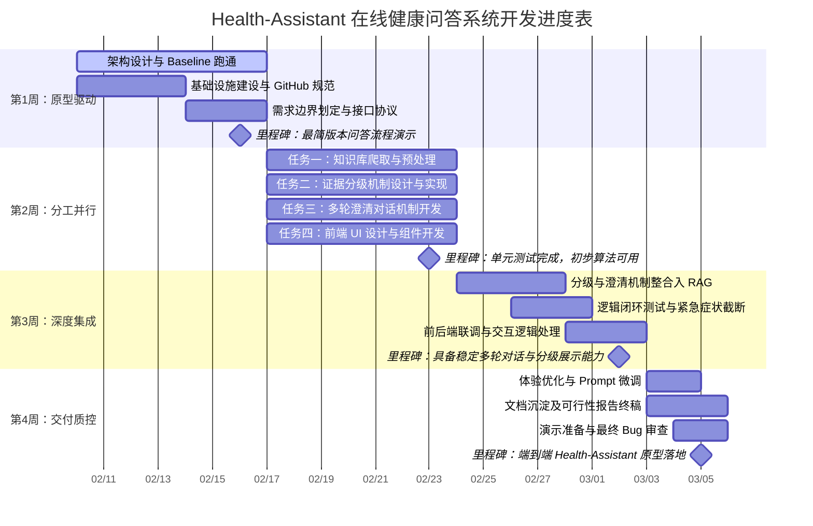

## 一、引言

本课题构建的在线健康问答助手（Health‑Assistant）是一个基于 RAG（检索增强生成）、证据分级机制与多轮澄清对话的智能健康信息服务系统。系统通过对用户自然语言问题的理解、多轮澄清获取关键信息，再结合本地健康知识库进行向量检索，最终调用大语言模型生成附带证据来源和等级的回答。

在大模型应用快速发展的背景下，健康问答场景同时面临“幻觉”、证据不可追溯、用户描述模糊等问题。本课题的目标是：
- **提高健康问答的可靠性与可解释性**：通过证据分级与可视化溯源，让用户清楚“答案从哪来、可信度如何”；
- **改善交互体验与安全性**：通过多轮澄清机制减少误解，对胸痛、呼吸困难等紧急症状及时给出就医提示；
- **沉淀可复用的工程实践**：在有限周期内完成一个端到端原型，为后续在保险、健康管理等实际业务中的落地提供技术样板。

本项目已完成后端 RAG 流水线、证据分级模块、多轮澄清对话管理器、知识库构建脚本以及前端对话界面与证据展示，证明该课题在技术与工程落地上具有较高可行性。以下从数据源、算法与模型、技术栈、进度和风险等方面进行系统分析。 

---

## 二、技术可行性分析

### 2.1 数据源可行性分析

#### 2.1.1 实际使用的公开数据源

根据 `backend_indexing_documentation.md` 与 `data/` 目录，系统当前整合的公开健康数据源包括：

- **百度医疗百科**  （439条）
  - 文件：`data/baidu_med_encyclopedia_1~5.json`  
  - 内容：常见疾病、症状、检查、治疗等百科条目；  
  - 特点：中文内容丰富，覆盖常见健康问题，结构相对规整（标题 + 正文），适合构建基础健康知识。

- **CDC 文章**  （48条）
  - 文件：`data/cdc_articles.json`  
  - 内容：美国疾病控制与预防中心发布的疾病防控与健康建议文章；  
  - 特点：来源权威性高，偏公共卫生与疾病预防。

- **WHO Fact Sheets**  （251条）
  - 文件：`data/who_fact_sheets_1~3.json`  
  - 内容：世界卫生组织官方 fact sheets，涵盖多种疾病与健康主题；  
  - 特点：国际权威、结构清晰（“Key facts”“Prevention”等段落）。

- **WebMD 数据**  （897条）
  - 文件：`data/webmd_data.json`  
  - 内容：国际知名健康网站 WebMD 的疾病介绍与健康建议；  
  - 特点：英文内容，有利于补充国际视角与某些细分病种信息。

- **Wikipedia 医学条目**  （1849条）
  - 文件：`data/wikipedia_data.json`  
  - 内容：选取的医学相关条目；  
  - 特点：结构化较好，适合做泛科普补充，需要通过证据分级降低其权重。

- **贴吧帖子（患者经验分享）**  （50条）
  - 文件：`data/tieba_posts.json`  
  - 内容：用户在健康相关贴吧的经验与讨论；  
  - 特点：主观性较强、质量参差不齐，系统通过证据分级将其整体作为低等级参考信息。

**所有数据共计3534条。**

所有原始数据经 `merge_data_to_kb.py` 合并为 `backend/data/crawled_knowledge_base.json`，再由 `knowledge_base/builder.py` 进行统一预处理和切分，最终形成约 4 万条文本块 `processed_kb_chunks.json` 并构建为 ChromaDB 向量库。 

#### 2.1.2 数据质量评估

- **权威性与可信度**  
  - WHO、CDC 等官方机构资料权威性高，可作为高等级证据基础；  
  - 百度医疗百科、Wikipedia 属于百科类，对常见概念有帮助，但存在更新滞后和细节专业性不一致的问题，因此在证据分级中通常评为中等或偏低等级；  
  - WebMD 等国际网站整体质量较好，但因语言与地区差异，需要在回答中以科普为主，避免直接指导具体诊疗决策；  
  - 贴吧等社区内容仅作为患者经验参考，在分级规则中被明确降权。

- **结构化与可处理性**  
  - 大部分数据以 JSON 结构存储（带标题、正文、URL、文档类型等字段），方便统一清洗与切分；  
  - 通过 `RecursiveCharacterTextSplitter` 按约 500 字符切分，并设置 50 字重叠，提升段落语义完整度和检索命中精度；  
  - 预处理阶段去除了脚注标记、目录噪声等，改善了向量化效果。

综合来看，系统当前选取的数据源在**权威性、覆盖面和可预处理性**上均满足一个教学/原型系统的需求；配合后续的证据分级机制，可以在工程上有效控制低质量信息的影响，因此数据源方案整体可行。 

#### 2.1.3 可访问性与获取难度

- 使用的数据源均来自**开放网页或公开 API/站点**，不依赖复杂认证流程；  
- 数据获取方式以一次性离线爬取 + JSON 存档为主，已经通过 `backend/crawler` 相关脚本完成抓取；  
- 由于项目采用本地 JSON + 本地向量库的方式，运行时不再依赖外部网络访问，降低了部署和演示的环境要求。

因此，在当前项目形态下，数据访问成本低、风险可控，数据层可行。 

---

### 2.2 算法与模型可行性分析

#### 2.2.1 RAG 与向量检索流程

后端 `rag_pipeline.py` 实现了完整的 RAG 流水线：

1. **向量检索**  
   - 使用 `knowledge_base.builder.get_vector_store()` 载入 ChromaDB；  
   - 基于用户（或澄清后）查询文本做相似度搜索，默认 `top_k=5`；  
   - 返回内容 + 元数据（标题、source_url、document_type 等）。

2. **证据分级**  
   - 对每个检索到的 chunk 调用 `compute_evidence_grade`（见 `evidence_grading.py` 与 `docs/evidence_grading_standard.md`）；  
   - 综合来源域名、source_name、publication_date、document_type 等信息，计算 0–100 分的综合得分，并映射到 Level 1–4；  
   - 生成包含 `evidence_level`、`evidence_score`、`level_explanation`、`source_url` 等字段的 `EvidenceItem`。

3. **Prompt 构建与 LLM 生成**  
   - 将检索结果连同证据等级格式化为带编号的参考资料区块，填入 `USER_PROMPT_TEMPLATE`；  
   - 使用 `SYSTEM_PROMPT` 严格约束模型：必须基于参考资料回答，不得编造；用药建议需提示就医；回答末尾需标明引用编号；  
   - 调用 `ChatOpenAI` 对接 Deepseek Chat / OpenAI 兼容模型，温度设为 0.3，兼顾稳定性与细节表达。

该流程在工程上已经打通并在前端完成集成，证明 RAG + 向量检索 + LLM 的核心链路在本项目中**技术成熟且可稳定运行**。 

#### 2.2.2 证据分级实现思路

证据分级模块在 `docs/evidence_grading_standard.md` 中给出了清晰的数学模型和规则：

- **等级定义**：Level 1（VERY_LOW）– Level 4（HIGH），从“仅供参考”到“高证据强度”；  
- **评分维度**：
  - 来源权威性（域名与名称白名单打分，如 who.int、cdc.gov 得分最高）
  - 内容时效性（根据发布日期自动衰减得分）
  - 文档类型（指南、系统综述、百科、论坛帖等给予不同加分/减分）  
- **综合得分公式**：  
  \[ 总分 = 权威性 × 0.5 + 时效性 × 0.3 + min(文档类型加分, 20) × 0.2 \]  
  再将总分映射到 Level 1–4。  
- **可解释性输出**：生成形如“来源得分 X，时效性 Y，文档类型加分 Z”的 `level_explanation`，前端可悬浮显示。

这一实现方式**不依赖复杂深度学习模型，完全基于规则与元数据计算**，因此在短周期内实现可控、可解释的证据分级是可行的，当前项目已经完成并通过测试脚本验证。 

#### 2.2.3 多轮澄清实现思路

多轮澄清由 `dialogue_manager.py` 中的 `EnhancedDialogueManager` 实现，整体思路为：

- **意图与症状识别**：通过关键词和正则，将问题归类为头痛、发烧、肠胃不适、用药、治疗等症状类型（`symptom_type`）；  
- **模糊与缺失信息检测**：
  - 检测“怎么办”“不舒服”“有点难受”等模糊表达；  
  - 针对不同症状，定义必须信息（如头痛的部位、性质、持续时间，发烧的体温值等），通过正则识别是否缺失；  
  - 识别儿童、孕妇、老人等特殊人群并提示缺少年龄、孕周等信息。  
- **澄清问题模板**：
  - 针对不同症状与缺失信息，准备多套结构化选项问题（如 A/B/C/D），并带有友好的开场白与进度提示；  
  - 用户回答可用字母或自由文本，manager 会将选项映射回自然语言含义。  
- **查询重写与用户画像**：
  - 维护 `user_profile`（年龄、性别、过敏史、基础疾病等）和 `clarification_answers`；  
  - 在澄清完成或到达轮次上限后，将原始问题与补充信息合并成更完整的“重写查询”，送入 RAG 检索。  
- **紧急症状处理**：对胸痛、呼吸困难、昏迷、高烧不退等关键词触发高优先级逻辑，直接返回“立即就医”的安全提示，不再进行普通检索回答。

该模块大量使用规则和正则表达式，无需额外训练小模型，在已有代码中已经实现并与后端 `/chat` 接口集成，说明**多轮澄清逻辑在当前工程条件下完全可行**。 

---

### 2.3 技术栈选型可行性

#### 2.3.1 后端技术栈

- **语言与框架**：Python + FastAPI  
  - FastAPI 自带类型标注与自动文档，方便在训练营环境中快速开发与调试；  
  - 与 LangChain、ChromaDB、Pydantic 等生态兼容良好。  

- **RAG 与检索组件**：  
  - LangChain 负责整合向量库与 LLM 调用；  
  - 向量库选用 ChromaDB，支持本地嵌入与快速相似度搜索；  
  - 对于教学与本地运行场景，ChromaDB 部署简单、运维成本低。

- **数据与配置管理**：  
  - 健康知识数据以 JSON 文件形式存储在 `data/` 与 `backend/data/`，利于版本管理与调试；  
  - LLM 相关配置通过 `.env` 管理，便于在不同 API 供应商之间切换。

**选型理由**：Python 在 NLP 与数据处理生态上成熟，FastAPI 学习成本低、性能足够；ChromaDB 免复杂部署适合训练营场景，因此整体后端技术栈在实现难度与稳定性之间取得良好平衡。 

#### 2.3.2 前端技术栈

- **React + Vite**：  
  - Vite 提供快速的开发体验；  
  - React 容易组织聊天 UI、证据面板与多会话侧边栏。  

- **UI 与渲染**：  
  - 使用 `ReactMarkdown + remark-gfm` 渲染后端返回的 Markdown 回答；  
  - 自定义组件 `EvidenceBadge`、`EvidenceCard` 负责展示证据等级与解释；  
  - 支持对话记录列表、loading 状态、澄清问题样式区分等。  

**选型理由**：React 在团队中普及度高，生态丰富；Vite 启动快速、配置简单，适合在短周期内完成一个交互体验较好的单页应用。 

#### 2.3.3 数据库与持久化

当前项目主要使用：
- ChromaDB 作为向量检索与文档存储；  
- 会话与历史记录在前端内存中管理（浏览器刷新后不持久）。  

在训练营/课程项目背景下，不强制要求引入额外关系型数据库，降低了运维复杂度；若后续需要长久保存用户对话，可在此基础上引入 SQLite/PostgreSQL 统一管理日志与画像信息。  

整体而言，前后端技术栈选型均基于主流成熟方案，与项目目标和时间约束高度匹配，技术风险较低。 

---

## 三、进度可行性分析

项目总周期约 3.5 周，整体采用**“原型驱动，并行迭代”**的开发模式：即首周集中力量跑通全链路 Baseline，随后各子任务组（数据预处理、证据分级、多轮澄清、前端集成）同步推进。规划如下：

#### 第 1 周（2/10 – 2/16）：原型驱动（Baseline 跑通）

- **架构设计与代码闭环**：确立 FastAPI + LangChain + ChromaDB 的后端架构，**跑通 RAG 全链路 Baseline**，验证“检索-生成”逻辑的可行性。
- **基础设施建设**：建立 **GitHub 规范化仓库**，完成环境依赖（Requirements）配置，确保 8 人小组具备统一的协作基础。
- **需求边界划定**：明确健康助手仅提供科普建议，严格排除诊断与处方功能。
- **里程碑**：成功演示最简版本的问答流程，确立各模块（任务一至任务四）的接口对接协议。

#### 第 2 周（2/17 – 2/23）：分工并行（核心模块开发）

此阶段各子小组基于已跑通的 Baseline 分头行动：

- **任务一（数据组）**：启动多源爬虫矩阵（WHO、中疾控等），累计获取 **3500+篇** 语料，并同步进行文本清洗与向量化索引优化。
- **任务二（算法组）**：开展证据分级文献调研（参考 GRADE 等标准），设计四级分级模型及加权评分公式。
- **任务三（对话组）**：研发多轮澄清机制，设计歧义检测与关键信息缺失检测逻辑。
- **任务四（前端组）**：启动 React + Vite 前端 UI 设计，搭建聊天输入区与交互组件原型。
- **里程碑**：各模块完成单元测试，形成可用的 `crawled_knowledge_base.json` 及初步的分级算法。

#### 第 3 周（2/24 – 3/2）：深度集成与场景调优

- **模块化整合**：将分级机制（Task 2）与多轮澄清逻辑（Task 3）正式并入 `rag_pipeline.py`，实现功能增强。
- **逻辑闭环测试**：调试 `EnhancedDialogueManager`，确保紧急症状（如立即就医提示）能准确截断普通 RAG 流程。
- **前后端联调**：完成前端与后端 `/chat` 接口的对接，处理澄清轮次与结果展示的交互逻辑。
- **里程碑**：系统具备稳定的多轮对话与分级展示能力，通过全链路场景化测试。

#### 第 4 周（3/03 – 3/05）：系统交付与质量控制

- **体验优化**：微调 Prompt 响应质量，优化前端 Loading 状态与对话滚动体验。
- **文档沉淀**：完成 **README** 说明、分级标准文档及本可行性分析报告。
- **演示准备**：进行项目 Demo 演示准备与最终 Bug 审查。
- **里程碑**：形成可在本地一键启动、具备端到端完整体验的 **Health‑Assistant** 原型。

---

## 四、团队协作计划

| **任务模块**                           | **成员**   | **具体分工**                                                 |
| -------------------------------------- | ---------- | ------------------------------------------------------------ |
| **任务一：健康知识库构建与预处理**     | **李小玥** | 1. 实现 RAG 架构全链路 Baseline，打通底层索引至检索生成的工程闭环； 2. 建立 GitHub 规范化仓库； 3. 累计爬取 729 篇多源数据（WHO、中疾控、百度百科、贴吧）； 4. 完成文本清洗、语义结构化切分；5.撰写可行性分析报告。 |
|                                        | **侯祯**   | 1. 编写爬虫从国外公开网站获取知识库数据（WebMD,Wikipedia )； 2. 负责知识库文本的向量化与索引工作； 3. 编写知识库索引文档。 |
| **任务二：证据分级机制设计与实现**     | **陈博文** | 1. 负责证据分级标准（GRADE、牛津分级等）的文献调研与理论定义； 2. 提炼简化分级模型，定义四级等级及其评估标准； 3. 提出多维度综合评估框架（来源、时效、文档类型）； 4. 撰写设计文档并协助单元测试。 |
|                                        | **李锡浩** | 1. 负责自动化分级算法的核心代码实现及加权评分公式编写； 2. 设计来源权重赋值策略，分配权威来源基础分值； 3. 将证据等级作为元数据集成至知识库，实现动态检索计算； 4. 负责单元测试与分级逻辑的优化验证。 |
| **任务三：多轮澄清对话机制设计与实现** | **章宇浩** | 1. 实现关键信息缺失检测机制及澄清需求综合判定模块； 2. 负责对话状态管理模块（DSM）； 3. 完成查询重写与选项映射模块开发。 |
|                                        | **屈奏权** | 1. 实现歧义检测机制与意图模糊性检测； 2. 实现紧急处理机制； 3. 负责模板问题的自然化处理优化。 |
| **任务四：集成与前端界面开发**         | **杜宇恒** | 1. 负责前端 UI 界面开发与设计； 2. 优化迭代核心问答流程； 3. 整合后端服务并合并完整业务流程。 |
|                                        | **莫锦浩** | 1. 负责全链路场景化系统测试与 Prompt 调优； 2. 负责交互可视化设计与功能完整性审查； 3. 负责项目交付质量控制及 Demo 演示。 |

## 五、风险分析与应对策略

### 5.1 技术与模型风险

- **LLM 幻觉与医学建议不准**  
  - 风险：即使有 RAG 约束，LLM 仍有可能出现不严谨或过度自信的医学陈述；  
  - 当前应对：
    - 在 `SYSTEM_PROMPT` 中明确要求答案必须基于参考资料，不足之处需说明“无法确定”；  
    - 对涉及用药的回答强制添加“需咨询医生”的提醒；  
    - 在前端显式展示证据来源与等级，让用户自行判断可信度；  
  - 后续优化：可进一步引入关键字过滤（如剂量、处方名）和“高风险问答拒答”策略。

- **外部 LLM 服务不稳定或限流**  
  - 风险：Deepseek / OpenAI 兼容接口可能在网络不佳或限流时导致响应变慢甚至失败；  
  - 当前应对：通过异常捕获返回友好错误提示，并保留已计算好的证据列表供用户参考；  
  - 备选方案：引入本地小型开源模型作为降级路径，或支持切换到其他兼容 API。 

### 5.2 数据与合规风险

- **版权与使用条款**  
  - 风险：部分数据来自公开网页，需要遵守站点条款与 robots 规范；  
  - 当前做法：在课程/训练营范围内，用于本地原型演示，不对外公开数据集；  
  - 备选方案：后续可逐步替换为开源数据集或官方公开 API，或只保留摘要级内容。 

- **数据质量参差与冲突信息**  
  - 风险：百科、社区内容可能与最新指南不完全一致；  
  - 当前缓解手段：通过证据分级给予权威机构更高等级和权重，将社区/百科信息降低为参考级；  
  - 后续可行方向：引入更新时间过滤与人工审核的重要条目。 

### 5.3 进度与工程复杂度风险

- **数据处理与索引构建超时**  
  - 风险：4 万条 chunk 索引构建时间与磁盘空间可能超出预期；  
  - 当前结果：文档显示构建时间约 1 分钟、索引大小约 285MB，在普通开发机上可接受；  
  - 预防措施：限制数据规模、控制 chunk 大小与维度数，必要时采用更轻量的索引配置。 

- **多轮澄清逻辑过于复杂导致 bug**  
  - 风险：大量正则与分支逻辑容易出错，影响澄清准确性；  
  - 已采取措施：在 `dialogue_manager.py` 中对正则边界、轮次限制、紧急症状优先级等进行了多次修复与注释说明；  
  - 后续建议：增加针对典型对话的单元测试与回归测试用例。 

### 5.4 用户体验与安全风险

- **响应延迟与交互卡顿**  
  - 风险：向量检索 + LLM 推理叠加可能导致响应时间偏长；  
  - 当前状况：本地向量库检索为毫秒级，瓶颈主要在外部 LLM 调用；  
  - 优化方向：控制上下文长度、合理选择模型、在前端增加明显的 loading 提示和渐进反馈。 

- **用户误将系统输出视为诊断**  
  - 风险：用户可能忽视免责声明，将回答当作诊断结果；  
  - 已有措施：
    - 在前端顶部和底部重复展示免责声明；  
    - 对紧急症状直接给出“立即就医”提示而非具体处理方案。  
  - 后续可以在涉及高风险关键词时增加“高亮警示”样式。 

---

## 六、结论

基于已完成的系统实现与上述分析，可以认为：

- 所选公开数据源在权威性、可获取性与可处理性方面均能满足当前项目需求；  
- RAG + 证据分级 + 多轮澄清的整体技术方案在当前开源生态和课程条件下**完全可行**，且已在本项目中得到验证；  
- 采用 Python/FastAPI + React/Vite + ChromaDB 的技术栈有效平衡了学习成本、开发效率与运行性能；  
- 在 2026/2/10–3/5 的周期内，按照规划分阶段推进可以完成一个端到端、可演示的在线健康问答助手原型；  
- 主要风险点（模型幻觉、数据质量、外部服务稳定性等）均有相应的工程层缓解措施。 

因此，从技术和工程落地角度看，本课题方案具备良好的可行性和实践价值。

